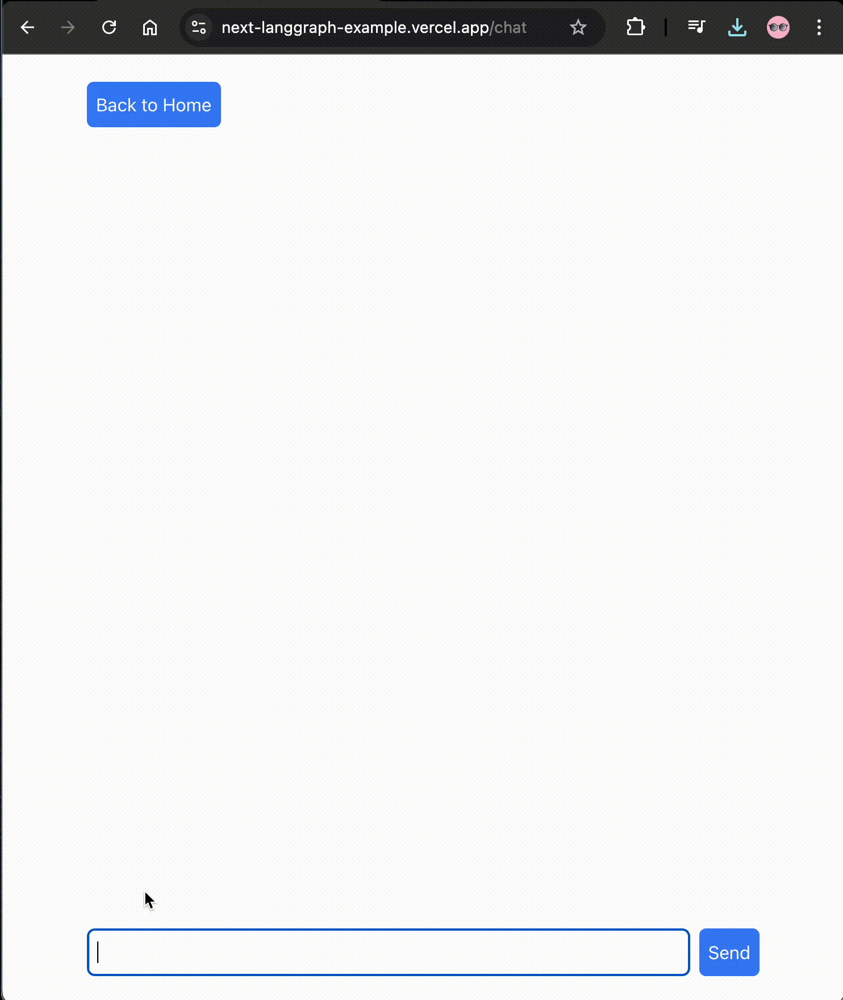
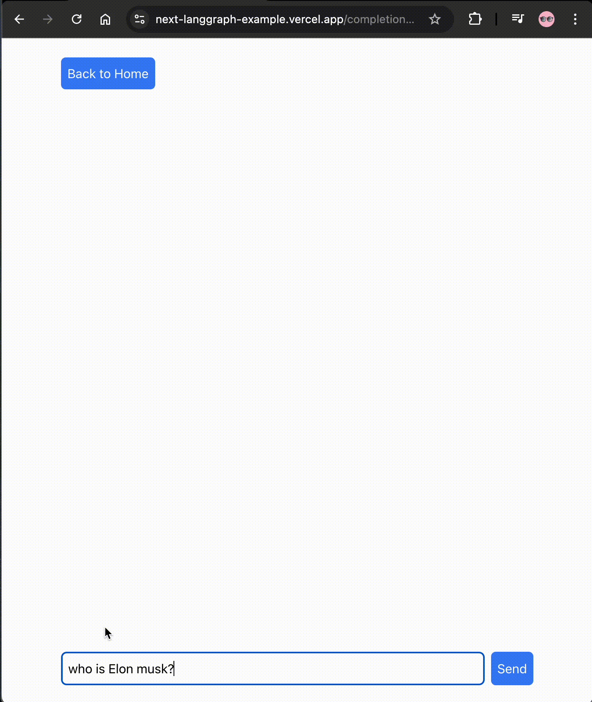

# Generative AI app built with Langgraph.js and Next.js

This is a simple app that demonstrates how to build a generative AI app with Langgraph.js, Next.js and Vercel AI SDK with streaming support.

> **Please leave a ⭐️ if you like the project!**

## Features

### Chat completions with history

Try out the chat completions with history demo at [https://next-langgraph-example.vercel.app/chat](https://next-langgraph-example.vercel.app/chat)



### Simple chat completions

Try out the simple chat completion demo at [https://next-langgraph-example.vercel.app/completion](https://next-langgraph-example.vercel.app/completion)



## How to run locally

1. Copy the `.env.example` file to `.env` and set the environment variables.

```bash
cp .env.example .env
```

2. Run the development server:

```bash
npm run dev
```

## Future work

- [x] Add simple chat completion
- [x] Add chat completions with history
- [ ] Add tool calling
- [ ] Add Generative UI with tool calling
